# AI-Powered Telegram Bot with n8n Workflow Automation

## 🚀 Workflow Architecture

```mermaid
flowchart LR
    User([User on Telegram]) -->|Sends text/voice/image| Bot[Telegram Bot]
    Bot --> N8N[n8n Workflow]

    N8N -->|Store/Fetch| Redis[(Redis Storage)]
    N8N -->|Generate Caption & Content| GPT[OpenAI GPT]
    N8N -->|Convert Voice to Text| Whisper[OpenAI Whisper]
    N8N -->|Generate Image| Dalle[OpenAI DALL·E]

    N8N -->|Publish Post| LinkedInAPI[LinkedIn API]
    LinkedInAPI --> LinkedIn[LinkedIn Published Post]
```

🚀 **Advanced n8n workflow for building intelligent Telegram bots with AI content generation, voice processing, and image handling capabilities**
## 🛠️ Features

- **AI Content Generation**: Automated LinkedIn post creation using OpenAI
- **Voice Message Processing**: Audio transcription with Telegram voice API
- **Image Generation & Processing**: Binary file handling and base64 conversion
- **Dynamic Workflow Routing**: Conditional logic for text/voice/image inputs
- **Error Handling**: Robust error management for unexecuted nodes
- **Telegram Integration**: Full webhook integration with inline keyboards

## 🔧 Tech Stack

- **Automation Platform**: n8n (Self-hosted/Cloud)
- **AI Integration**: OpenAI API (GPT models)
- **Messaging Platform**: Telegram Bot API
- **File Processing**: Binary to Base64 conversion
- **Voice Processing**: Audio transcription
- **Image Processing**: AI image generation and binary handling

## 📋 Workflow Components

### Core Nodes:
- Telegram Trigger (Webhook)
- Voice Message Detection (IF Node)
- AI Content Generation (OpenAI)
- Image Processing Pipeline
- Binary File Handler
- Dynamic Data Merger
- Error Handling Logic

### Key Features:
- Conditional branching based on input type
- Safe node execution handling
- Binary data preservation
- Multi-format output support
